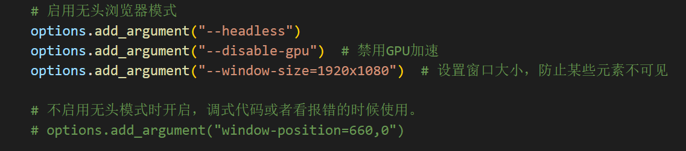

# twitter_Crawler
推特爬虫/X/twitter

#### 前排提示：第一次运行的话，浏览器可能启动比较慢，原因未知。可以久等一会。

### 1.<a href="#twitter_Crawler_2"> twitter_Crawler_2 新方法修复bug，同时下载</a>

### 2.<a href="#old_version"> old_version 旧方法但是没有本质区别 </a>

### 3.<a href="#problems"> 目前存在的问题</a>

# 注意事项

## 第一步获取cookie
1. 使用的方法是运行 ***set_cookie.py*** 。然后在30s在网页上登陆推特。

2. 等待页面关闭。就能获取到用来登陆的cookie，会以 ***X.json*** 保存在文件夹中。

## 一些其他说明
1. 由于推特页面是动态加载的，所有使用selenium库对浏览器进行操作，来刷新页面，并获取页面中图片的下载地址，以及在network中获取视频和GIF的地址。最后用request请求下载到本地。

2. 下载使用线程锁，一次同时下载10张图片和3个视频。如果对网速很有自信。可以在 ***download_method.py*** 中对 ***video_connections*** 和 ***img_connections***的值进行更改

## <a id="twitter_Crawler_2">twitter_Crawler_2</a>
1. 在28行修改页面地址。直接运行即可。

2. 对于可修改的页面，主页和媒体都是可以爬取的。推荐爬媒体界面吧，主页有各种乱七八糟的转发，虽然后面也可以修改不爬这些，但是这样为什么不直接爬媒体捏。

3. 在`driver_init.py`中使用了无头浏览器，如果不知道报错咋回事，可以把无头浏览器注释了看看什么情况。这两个模式选一个就行。默认未使用无头浏览器，因为我使用的时候不知道为什么有bug。

4. 修复了一些bug，新添加了未知bug

## <a id="old_version">old_version</a>

1. 在`twitter_Crawler`111行修改页面地址。直接运行即可

2. 默认把图片，视频，gif全部下载了。

## <a id="problems"> 目前存在的问题</a>

1. 当media页面中的部分含有多个内容时，只能下载封面这一张内容。目前想到l解决方法，但是还没尝试，可能也不太有时间了。有需求可以自己尝试一下。思路在way.md中。

